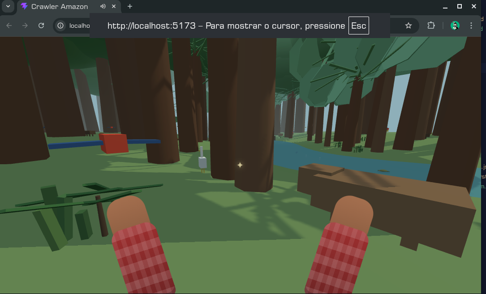
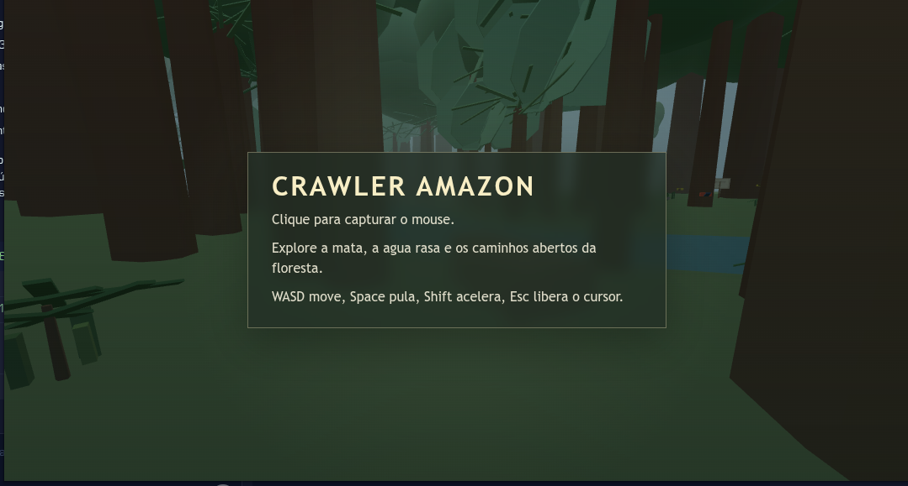

# Crawler Amazon

Experimento de exploracao 3D em primeira pessoa, rodando no navegador com `Three.js`, focado em uma paisagem amazonica estilizada com relevo procedural, biomas, fauna distribuida por biomassa, clima dinamico e interacoes de observacao.



## Estado atual

O projeto ja possui:

- locomocao em primeira pessoa com colisao e salto
- mundo procedural em faixa retangular no sentido do rio
- quatro biomas legiveis: `mata ciliar`, `varzea`, `terra firme` e `lago`
- ciclo de `dia`, `noite` e `chuva`
- fauna terrestre, arborea, aerea e aquatica
- flora distribuida por especie e idade
- interacao de proximidade com animais e algumas especies vegetais
- HUD com crosshair, prompt e painel de informacao
- controles touch para Android com joystick virtual, olhar por arraste e botoes de acao
- placas de bioma geradas proceduralmente

## Stack

- JavaScript ES Modules
- Three.js
- WebGL
- Vite

## Como rodar

```bash
npm install
npm run dev
```

Build de producao:

```bash
npm run build
```

## Estrutura principal

```text
src/
  core/
    Game.js
    Loop.js
    Renderer.js
  scene/
    Camera.js
    Player.js
    World.js
  systems/
    InputSystem.js
    MovementSystem.js
    SoundSystem.js
  data/
    treeSpecies.json

docs/
  architecture.md
  environment.md
  fauna.md
  flora.md
  geografia.md
  gamestyle.md
  relevo.md
  start.md
  target.md
```

## Documentacao

- [architecture.md](docs/architecture.md)
- [environment.md](docs/environment.md)
- [relevo.md](docs/relevo.md)
- [flora.md](docs/flora.md)
- [fauna.md](docs/fauna.md)
- [geografia.md](docs/geografia.md)
- [screenshots.md](docs/screenshots.md)
- [v2-world-streaming.md](docs/v2-world-streaming.md)

## Screenshots

Tela inicial e HUD:



## Direcao do projeto

O jogo procura um meio-termo entre:

- exploracao contemplativa
- museu interativo ao ar livre
- legibilidade de especies e biomas
- baixo custo de renderizacao

Nao busca simulacao total nem hiper-realismo.
